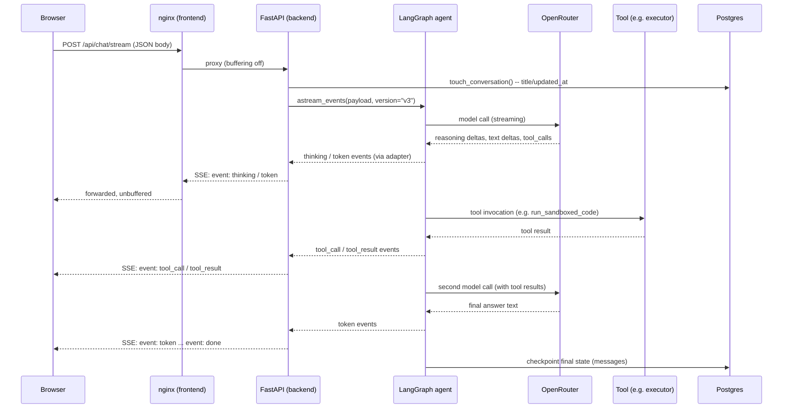
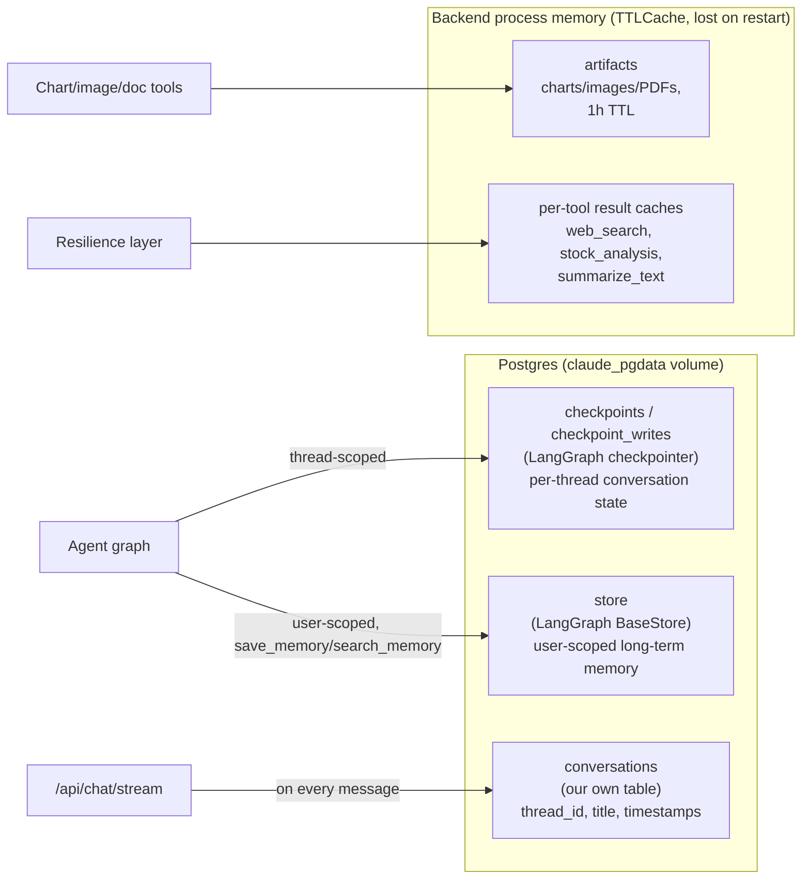

# Architecture

## Containers and networks

Four containers, two Docker networks, deliberately shaped around one
principle: **the component with the most dangerous capability (spawning
arbitrary containers via the Docker socket) is isolated from everything
except the one service that needs to call it.**

```mermaid
flowchart TB
    subgraph host["Host"]
        subgraph default_net["default network"]
            frontend["frontend<br/>(nginx)<br/>:8080 published"]
            backend["backend<br/>(FastAPI)<br/>no published port"]
            postgres[("postgres<br/>no published port")]
        end
        subgraph sandbox_net["sandbox network (internal: true)"]
            backend
            executor["executor<br/>(FastAPI + docker-py)<br/>no published port"]
        end
        socket[["/var/run/docker.sock"]]
    end

    browser["Browser"] -->|":8080"| frontend
    frontend -->|"/api/* proxy"| backend
    backend --> postgres
    backend <-->|HTTP, internal only| executor
    executor -.->|mounted, read-write| socket

    style sandbox_net fill:#3a2d22,stroke:#d9784f
```

| Container | Published port | Networks | Why |
|---|---|---|---|
| `frontend` | `8080:80` | `default` | The only thing meant to be reachable from your browser |
| `backend` | none | `default` + `sandbox` | Needs Postgres (`default`) and the executor (`sandbox`), but is never dialed directly -- nginx is the only path in |
| `postgres` | none | `default` | Only `backend` needs it |
| `executor` | none | `sandbox` (`internal: true`) | Holds the Docker socket mount -- isolated so a compromised `backend` or `frontend` has no network path to it, and it has no outbound internet access either |

The `sandbox` network has `internal: true`, which means containers whose
*only* network is `sandbox` (just `executor`) get no outbound internet
access at all, on top of not being reachable from `frontend`/`postgres`.
`backend` sits on both networks, so it keeps its own outbound access (to
OpenRouter, to Postgres) while also being able to reach `executor`.

See [Security](security.md) for the full reasoning behind this split, and
for what was actually tested (not just configured) to confirm it holds.

## Request flow: a chat message

Full detail on the SSE event design, the LangGraph v3 streaming API, and
what had to be corrected after actually running it: see
[Streaming Design](streaming.md).

## Data flow: where state lives

Three different persistence/caching strategies, each matched to what it's
storing:

- **Checkpoints** (per-thread conversation history) and **the long-term
  memory store** (user-scoped, survives across threads) both live in
  Postgres via LangGraph's own checkpointer/store abstractions -- these
  survive `docker compose restart backend`.
- **Conversation metadata** (titles, timestamps for the sidebar) is a
  small dedicated Postgres table, kept deliberately separate from
  LangGraph's internal checkpoint schema (an implementation detail of
  `langgraph-checkpoint-postgres` that could change across versions).
- **Artifacts** (generated charts/images/PDFs) and **per-tool result
  caches** are in-memory `TTLCache`s on the backend process -- intentionally
  ephemeral, lost on restart. A generated chart doesn't need to survive a
  backend redeploy; a conversation does.

## Why four containers, not fewer

The original design (see [Streaming Design](streaming.md) for the
streaming-specific history) started as three: `backend`, `frontend`,
`postgres`. `executor` was added specifically because sandboxed code
execution needs a *different* isolation boundary than everything else in
the stack -- see [Sandboxed Code Execution](tools/sandbox-exec.md) for why
that couldn't just be a function inside `backend`.
