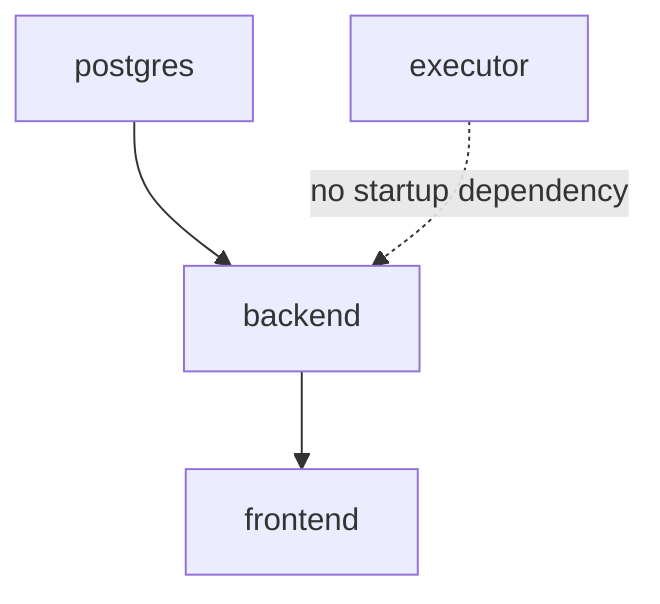

# Deployment

Local Docker Compose is the only deployment target this project supports
today. This page documents the `docker-compose.yml` shape in detail; see
[Roadmap &rarr; Kubernetes deployment guide](roadmap.md#kubernetes-deployment-guide)
for what a cluster deployment would need to look like instead (it's a
meaningfully different design for the sandbox executor specifically, not
just a lift-and-shift).

## Services

```yaml
services:
  postgres:   # postgres:16-alpine, pg_isready healthcheck, named volume
  executor:   # builds ./executor, mounts /var/run/docker.sock, sandbox network only
  backend:    # builds ./backend, default + sandbox networks, no published port
  frontend:   # builds ./frontend, default network, publishes 8080:80
```

Full network reasoning: [Architecture](architecture.md#containers-and-networks).

## Build order / dependencies



`backend` has a hard `depends_on: postgres: condition: service_healthy`.
`executor` deliberately has **no** `depends_on` relationship with
`backend` -- it starts independently, and a `run_sandboxed_code` call made
before `executor` is ready simply fails gracefully through its circuit
breaker rather than blocking the whole backend's startup.

## Volumes

One named volume, `pgdata`, mounted at Postgres's data directory. Survives
`docker compose down` (without `-v`); destroyed by `docker compose down -v`.
Everything else (artifact store, per-tool caches) is intentionally
in-memory and ephemeral -- see
[Architecture &rarr; Data flow](architecture.md#data-flow-where-state-lives).

## Images

| Service | Base image | Notable build steps |
|---|---|---|
| `backend` | `python:3.12-slim` | Bakes NLTK `punkt` tokenizer data at build time (so `summarize_text` never needs runtime network access just to tokenize); copies `mcp_demo_server.py` + `mcp_servers.json` |
| `executor` | `python:3.12-slim` | Installs `docker` (the Python SDK), nothing else unusual |
| `frontend` | `nginx:alpine` | Copies static files + `nginx.conf`; no build step for the JS (plain files, no bundler) |
| `postgres` | `postgres:16-alpine` | Stock image |

## nginx: SSE-critical configuration

`frontend/nginx.conf`'s `/api/` location block carries directives that
exist specifically so Server-Sent Events stream live instead of arriving
in one buffered burst at the end:

```nginx
location /api/ {
    proxy_pass http://backend:8000/api/;
    proxy_http_version 1.1;
    proxy_set_header Connection "";
    proxy_buffering off;      # <-- without this, SSE arrives all at once
    proxy_cache off;
    proxy_read_timeout 300s;  # <-- default 60s would kill a long-idle stream
    proxy_send_timeout 300s;
}
```

Confirmed live (not just configured): a `curl -N` through the real nginx
proxy showed a `text/event-stream` response with `Transfer-Encoding:
chunked` and no `Content-Encoding: gzip`, and events arriving incrementally
rather than delayed.

## Rebuilding after a code change

```bash
docker compose up -d --build backend frontend   # most common
docker compose up -d --build                     # everything, including executor
```

`executor` only needs rebuilding if `executor/` itself changed --
`backend`/`frontend` changes don't require it.

## A note on renaming the project directory

Docker Compose derives its project name from the containing directory by
default. Renaming the project folder (as happened during this project's
own development, twice) changes the Compose project name, which means a
plain `docker compose up` after the rename creates an **entirely separate**
set of containers/networks/volumes rather than reusing the old ones --
including a fresh, empty Postgres volume. If this happens to you:

```bash
# Stop the old stack by its old project name (the volume survives):
docker compose -p <old-name> down

# Then bring up the renamed stack normally:
docker compose up -d --build
```

The old Postgres volume isn't deleted by `down` (without `-v`) -- decide
separately whether to migrate its data or remove it once you've confirmed
the new stack is healthy.
