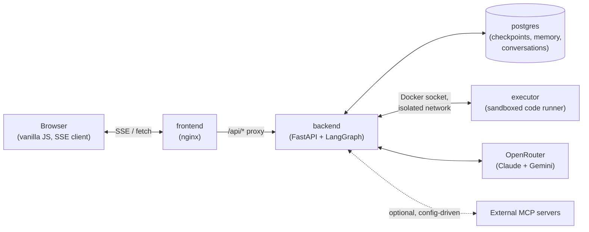

# Anupam's Claude

A study project built to learn LangGraph's streaming capabilities end to
end: a LangGraph agent (Claude, via OpenRouter) wrapped in FastAPI, streamed
live to a vanilla-JS frontend over Server-Sent Events. Tokens, "thinking"
(reasoning), and tool-call events all arrive as they happen, not just at the
end -- including multiple tool calls running in parallel.

It grew from a minimal streaming demo into a 13-tool agent with sandboxed
code execution, chart/diagram/image/document generation, external MCP
server connectivity, long-term memory, and a Claude-style chat UI with a
date-grouped conversation sidebar.

## What it is, in one diagram

Four containers (`frontend`, `backend`, `executor`, `postgres`), each with a
deliberately narrow job -- see [Architecture](architecture.md) for the full
breakdown of what talks to what, and why `executor` sits on its own network.

## Where to start

- :material-rocket-launch:{ .lg .middle } **New here?**

    ---

    Get the stack running in a few minutes.

    [:octicons-arrow-right-24: Getting Started](getting-started.md)

- :material-sitemap:{ .lg .middle } **Want the big picture?**

    ---

    Containers, networks, data flow, and why things are isolated the way
    they are.

    [:octicons-arrow-right-24: Architecture](architecture.md)

- :material-flash:{ .lg .middle } **Curious how streaming works?**

    ---

    The SSE event model, the LangGraph v3 adapter, and the bugs that only
    showed up when actually running it.

    [:octicons-arrow-right-24: Streaming Design](streaming.md)

- :material-toolbox:{ .lg .middle } **What can the agent do?**

    ---

    All 13 tools, one page each, with the real verified behavior.

    [:octicons-arrow-right-24: Tools](tools/index.md)

- :material-shield-lock:{ .lg .middle } **Security model**

    ---

    What's isolated from what, and the explicit trust boundaries (sandbox
    executor, MCP servers, markdown rendering).

    [:octicons-arrow-right-24: Security](security.md)

## A note on how this documentation was written

Every claim in this site was checked against the running system, not
written from assumption -- API shapes confirmed by reading installed
library source, security properties confirmed by actually trying to break
them (network calls that fail, files that won't write outside `/tmp`, XSS
payloads that get stripped), and tool behavior confirmed by real tool calls
through a real model. Where something is a judgment call or a known
limitation rather than a verified fact, it's called out as such rather than
smoothed over.
