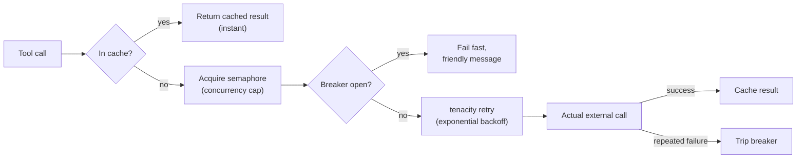

# Tools Overview

13 tools, each registered in `backend/app/tools/__init__.py`'s
`build_tool_list()` and advertised to the model via `create_agent`'s
`tools=` list and the system prompt in `backend/app/agent.py`.

| Tool | Cached? | Breaker/retry? | External dependency |
|---|---|---|---|
| [`web_search`](web-search.md) | :material-check: 5 min TTL | :material-check: | DuckDuckGo (no key) |
| [`calculator`](calculator.md) | :material-close: | :material-close: | none (pure function) |
| [`stock_analysis`](stock-analysis.md) | :material-check: 5 min TTL | :material-check: | Yahoo Finance via `yfinance` |
| [`summarize_text`](summarize-text.md) | :material-check: 5 min TTL | :material-check: | arbitrary URLs |
| [`run_sandboxed_code`](sandbox-exec.md) | :material-close: (deliberate) | :material-check: | `executor` service |
| [`generate_chart`](charts-diagrams.md) | :material-close: | :material-close: | none (matplotlib, local) |
| [`generate_diagram`](charts-diagrams.md) | :material-close: | :material-close: | none (text passthrough) |
| [`generate_image`](image-generation.md) | :material-close: (deliberate) | :material-check: | OpenRouter (Gemini) |
| [`generate_html`](documents.md) | :material-close: | :material-close: | none |
| [`generate_pdf`](documents.md) | :material-close: | :material-close: | none (reportlab, local) |
| [`save_memory`](memory.md) | n/a | :material-close: | Postgres |
| [`search_memory`](memory.md) | n/a | :material-close: | Postgres |
| external MCP tools | n/a | n/a | whatever `mcp_servers.json` points at |

## The resilience pattern

Tools with an external dependency that can fail or get slow are wrapped in
a consistent four-layer stack, cheapest check first:



- **Cache** (`cachetools.TTLCache`): bounded size + time-based expiry in one
  structure -- a hit skips everything else. Deliberately **not** applied to
  `run_sandboxed_code` or `generate_image`, since their output can
  legitimately differ between calls with identical-looking input (random
  code execution, creative image generation) -- see
  `NO_CACHE_TOOL_NAMES` in `backend/app/resilience/circuit_breaker.py`.
- **Semaphore**: caps concurrent outbound calls per tool, so a burst of
  parallel tool calls (the model is explicitly allowed to fire several at
  once -- `model_kwargs={"parallel_tool_calls": True}`) doesn't trigger
  upstream rate-limiting on a free, no-key service.
- **Circuit breaker** (`aiobreaker`, `fail_max=3`, 30s reset): opens after 3
  consecutive failures, fails fast with an in-band message the agent can
  relay to the user, instead of hanging the whole SSE turn.
- **Retry** (`tenacity`, exponential backoff with jitter): scoped to the
  innermost fetch call, *inside* the breaker -- repeated transient failures
  still count toward tripping it.

All of this lives on `AgentRuntime` (`backend/app/runtime.py`), built once
at startup and passed into every tool factory -- nothing is rebuilt per
request. See [Backend Overview](../backend/index.md#agentruntime).

## Artifacts: how binary output reaches the browser

Four tools (`generate_chart`, `generate_image`, `generate_html`,
`generate_pdf`) produce output too large or too binary to put in the LLM's
own context or stream through SSE as text. All four use the same pattern:

```python
artifact_id = save_artifact(artifact_store, data_bytes, content_type)
return json.dumps({"text": "short description", "artifact_id": artifact_id, "content_type": content_type})
```

The tool's return value (what the LLM sees) stays a short string plus an
id. The actual bytes are stored in an in-memory `TTLCache` (1 hour) and
served over `GET /api/artifacts/{id}`. The frontend's `tool_result` handler
detects this JSON shape and either renders an `` (image content
types) or a download link (everything else) -- see
[Frontend](../frontend.md#structured-tool-results).

This was established in the first of these four tools built
(`generate_chart`) specifically so the other three could reuse it
unchanged -- confirmed when `generate_image` was added later and needed
*zero* new frontend code.
