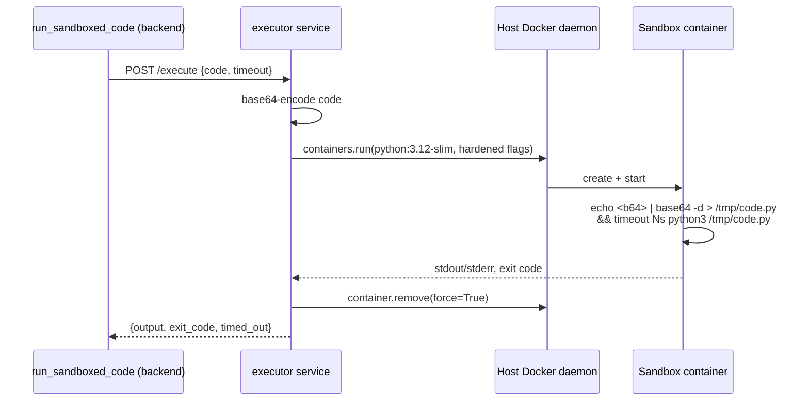

# Sandboxed Code Execution

`backend/app/tools/sandbox_exec.py` (the tool) + `executor/` (the service
that actually runs the code)

```python
@tool
async def run_sandboxed_code(code: str, timeout: int = 10) -> str:
    """Execute Python code in an isolated, network-disabled sandbox
    container and return its stdout/stderr."""
```

The tool itself just POSTs `{code, timeout}` to the internal `executor`
service and relays the result. All the actual isolation work happens in
`executor/app/sandbox.py`.

## Why a separate service, not a function in `backend`

Running arbitrary code safely requires access to something powerful: the
ability to create a new, isolated container per execution. The two ways to
get that from inside a container are:

1. Mount the **host's** Docker socket (`/var/run/docker.sock`) into
   whichever container needs to spawn sibling containers.
2. Use a managed sandboxing API (E2B, Modal, Daytona, ...) -- offloads the
   isolation to a third party, adds an external dependency and cost.

This project uses (1), because it keeps everything self-hosted. But the
Docker socket is effectively **root-equivalent access to the host** --
anything that can reach it can control every container on the machine, not
just its own. That capability must never be mounted into `backend` (which
also handles OpenRouter calls, Postgres access, and is one layer removed
from user input via tool-calling). It's isolated into its own `executor`
service instead, reachable only from `backend` over an internal-only
Docker network -- see [Architecture](../architecture.md) and
[Security](../security.md) for the full network diagram and reasoning.

## How a single execution works



Code is passed in via a **base64-encoded shell one-liner**, not a volume
mount or direct string interpolation -- this sidesteps shell-quoting edge
cases from the submitted code entirely, since base64's output alphabet has
no shell-special characters.

## The hardening flags, and what each one actually blocks

```python
client.containers.run(
    image="python:3.12-slim",
    command=["sh", "-c", inner_cmd],
    detach=True,
    network_disabled=True,
    mem_limit="128m",
    nano_cpus=500_000_000,       # 0.5 CPU
    pids_limit=64,
    read_only=True,
    tmpfs={"/tmp": "size=16m"},
    user="65534:65534",          # nobody -- never root inside the sandbox
    cap_drop=["ALL"],
    security_opt=["no-new-privileges"],
)
```

| Flag | Blocks |
|---|---|
| `network_disabled=True` | Any outbound network call |
| `read_only=True` + `tmpfs` only on `/tmp` | Writing anywhere outside `/tmp` |
| `user="65534:65534"` | Running as root inside the container |
| `cap_drop=["ALL"]` | Linux capabilities (raw sockets, module loading, etc.) |
| `security_opt=["no-new-privileges"]` | setuid/setgid privilege escalation |
| `mem_limit` | Memory exhaustion |
| `nano_cpus` | CPU exhaustion |
| `pids_limit` | Fork bombs |

A wall-clock `timeout` wraps the Python invocation inside the container
(primary enforcement); `container.wait(timeout=timeout+5)` at the SDK level
is defense in depth in case that somehow doesn't fire, force-killing the
container if the SDK-level wait itself times out.

## Verified live -- every single property above, not just configured

Before writing any of the FastAPI wrapper, each hardening property was
tested directly against the real local Docker daemon:

```python title="Network test"
>>> import socket
>>> socket.create_connection(("8.8.8.8", 53), timeout=3)
[Errno 101] Network is unreachable
```

```python title="Read-only filesystem test"
>>> open("/etc/evil", "w").write("x")
OSError: [Errno 30] Read-only file system: '/etc/evil'
```

```python title="Fork bomb / pids_limit test"
>>> import os
>>> for _ in range(2000): os.fork()
[Errno 11] Resource temporarily unavailable   # after ~5-8 forks
# container exit code: 137 (SIGKILL from pids cgroup)
```

```python title="Memory limit test"
>>> x = bytearray(500 * 1024 * 1024)   # under a 64m mem_limit
Killed
# container exit code: 137 (OOM kill)
```

Then verified again through the **real deployed tool**, via a real model
call that was explicitly asked to try breaking out:

!!! quote "Real agent response to 'try reaching google.com and writing a file outside /tmp'"
    ```text
    TEST 1: Attempting outbound network request to google.com
    FAILED: URLError(gaierror(-3, 'Temporary failure in name resolution'))

    Attempt 2a: Writing to /home/testfile.txt
    FAILED: OSError(30, 'Read-only file system')

    Attempt 2b: Writing to /root/testfile.txt
    FAILED: PermissionError(13, 'Permission denied')

    Attempt 2c: Writing to /etc/testfile.txt
    FAILED: OSError(30, 'Read-only file system')

    Attempt 2d: Writing to /tmp/testfile.txt (for comparison)
    SUCCESS: Verified: Read back content: 'test content'
    ```

Network isolation between containers was also confirmed at the Docker
network level, not just inside the sandbox: `backend` can reach `executor`
(`curl` from inside the `backend` container succeeds), `frontend` cannot
(`wget` from inside `frontend` fails to even resolve the hostname
`executor` -- it's not on that network at all).

## Known gap

Per-pod/per-container PID limiting is solid here because it's plain Docker
(`pids_limit`), but this specific mechanism doesn't translate directly to
a Kubernetes deployment -- see [Roadmap](../roadmap.md#kubernetes-deployment-guide)
for the K8s-equivalent design (Jobs created via a narrowly-scoped RBAC
Role instead of a socket mount, NetworkPolicy instead of a Docker network,
and the PID-limiting gap flagged honestly rather than papered over).
